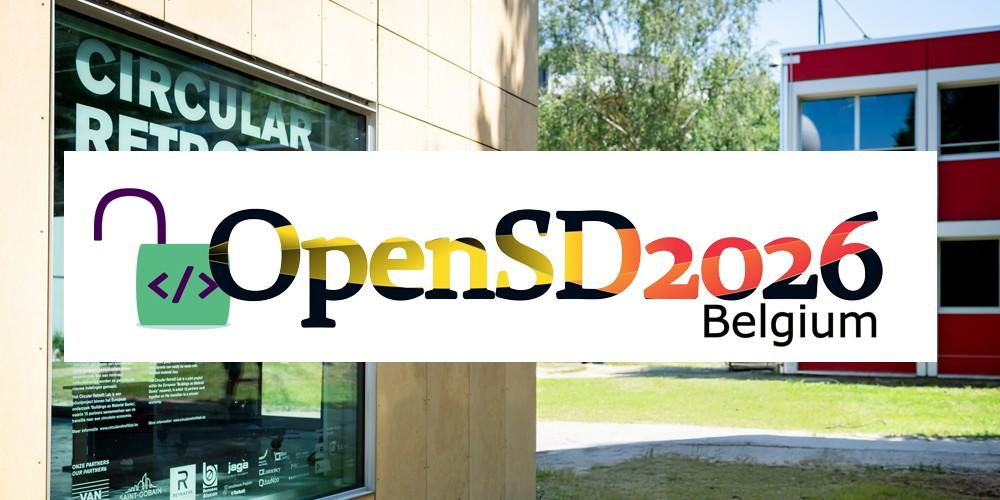

[](https://www.vub.be/en/event/opensd-summer-school-belgium)

# Workshop_OpenSD2026
Repository containing the materials for the OpenSD2026 Workshop in Belgium, providing a hands-on introduction to Python programming for structural dynamics.  Workshop page: https://www.vub.be/en/event/opensd-summer-school-belgium

## Repository layout
- `src/` Python source package for workshop
- `notebooks/` folder that contains the workshops 
- `notebooks/01_introduction/01_introduction.ipynb`
- `notebooks/02_python_fundamentals/02_python_fundamentals.ipynb`
- `notebooks/02_python_fundamentals/02_python_fundamentals.ipynb`
- `notebooks/03_structural_dynamics/03_structural_dynamics.ipynb`
- `notebooks/04_AI_for_SHM/04_AI_for_SHM.ipynb`

## Working on the workshop 
There are two main ways to work with the workshop materials:

GitHub Codespaces
Recommended during the workshop. It provides a ready-to-use development environment directly in the browser.
Local installation
Clone the repository and run the workshop on your own computer.

## Dependency management with uv

This repository uses [uv](https://docs.astral.sh/uv/) to manage Python dependencies.

```bash
uv sync
uv run jupyter lab
```

## Testing with pytest

Tests live in `tests/` and follow pytest's `test_*.py` naming convention. Run them with:

```bash
uv run pytest
```

## License

Copyright © 2026 OpenSD2026 contributors. All rights reserved. The materials in this repository are provided for educational use only and may not be copied, redistributed, or modified without prior permission. See [LICENSE](LICENSE).
